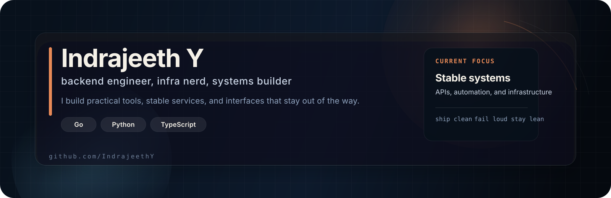
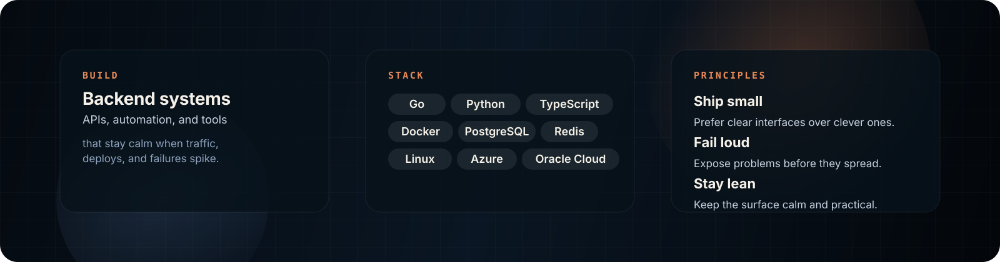

  

  

  <strong>Backend engineer building calm systems, sharp APIs, and useful automation.</strong>

  <a href="https://indrajeeth.in">Website</a> ·
  <a href="mailto:mail@indrajeeth.in">Email</a> ·
  <a href="https://github.com/IndrajeethY">GitHub</a>

  <code>Go</code> <code>Python</code> <code>TypeScript</code> <code>Linux</code> <code>Docker</code> <code>PostgreSQL</code> <code>Redis</code> <code>Azure</code> <code>Oracle Cloud</code>

<table width="100%">
  <tr>
    <td width="50%" valign="top">
      
    </td>
    <td width="50%" valign="top">
      
    </td>
  </tr>
</table>

  

